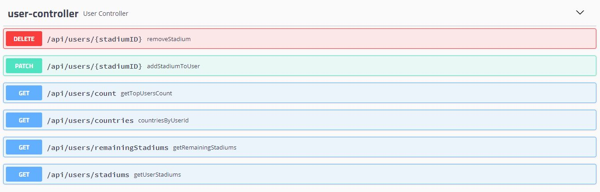

<!-- PROJECT LOGO -->
<br />
<div align="center">
   
</div>


## Table of Contents
* [General Info](#general-information)
* [User Stories](#user-stories)
* [Setup](#setup)
* [Technologies Used](#technologies-used)
* [Models](#models)
* [Server Routes](#server-routes-table)
* [Project Status](#project-status)
* [Room for Improvement](#room-for-improvement)
* [Resources](#resources)


## :grey_exclamation: General Information
This project serves as a backend or server side functionality to the Stadium Hunter WebApp, accepting HTTP requests.
This server implements authentication and authorization over the HTTP requests.
Stadium Hunter is an app that allows users to keep track of all the football stadiums they have visited and leave reviews on them.

## :girl: User Stories
* As a User I want to track all the stadiums I'have visited all around the world.
* As a User I want to leave review about the stadiums i have visited, so other users can benefit from my opinion.
* As a User I want to see other users reviews about stadium i want to visit.


## :gear: Setup

  Clone the Stadium Hunter API. In a terminal, run:
```bash
$ git clone https://github.com/Openbank-Java-Bootcamp/Pilar-Alvarez-Stadium-Hunter-Server
```

  Before running the API server, you should set the database config with yours or set your database config with my values.


## :hammer_and_wrench: Technologies used

* [Java](https://www.java.com/es/)
* [SpringBoot](https://spring.io/projects/spring-boot)
* [MySQL](https://www.mysql.com/)
* [Postman](https://www.postman.com/)


## :world_map: Models


The Model is composed by:

-Users

-Stadiums

-Reviews


Each user has a list of Stadiums visited and another list of all the Stadiums that hasn't visited yet.
Users can add stadiums to their list or remove stadiums from it.
Users can add reviews to the stadiums that have been at.


## :key: Server Routes Table
 
| Request Type  | Route                        | Description                                              | Authorization       | Requested Data            |
| ------------- | -----------------------------| ---------------------------------------------------------|---------------------|---------------------------|
| `DELETE`      | /api/users/{stadiumId}       | Logged in user can delete a Stadium from their list.     | AUTHENTICATED USER  |Stadium Id        |
| `PATCH`       | /api/users/{stadiumId}       | Logged in user can add a Stadium to their list.          | AUTHENTICATED USER  |Stadium Id   |
| `GET`         | /api/users/count             | Get the top 5 users with most stadiums visited           | AUTHENTICATED USER  |   |
| `GET`         | /api/users/countries         | Get the number of countries the logged in user has visited stadiums at. | AUTHENTICATED USER  |    |
| `GET`         | /api/users/remainingStadiums | Get the list of remainin Stadiums of the logged in user  | AUTHENTICATED USER  |    |
| `GET`         | /api/users/stadiums          | Get the list of visited Stadiums of the logged in user   | AUTHENTICATED USER  ||
| `GET`         | /api/stadiums                | Get all the stadiums in the db                           | AUTHENTICATED USER  ||
| `POST`        | /api/stadiums                | Add a new Stadium to the db                              | AUTHENTICATED USER  |Stadium Object|
| `GET`         | /api/stadiums/{stadiumId}    | Get a Stadium by its Id                                  | AUTHENTICATED USER  |StadiumId|
| `GET`         | /api/review/avg/{stadiumId}  | Get the avg rating of a stadium by its id                | AUTHENTICATED USER  |StadiumId|
| `GET`         | /api/review/count            | Get the top users with most of reviews on stadiums       | AUTHENTICATED USER  ||
| `POST`        | /api/reviews                 | Save a new review                                        | AUTHENTICATED USER  |ReviewDTO object|
| `GET`         | /api/reviews/{stadiumId}     | Get review by stadium Id                                 | AUTHENTICATED USER  |StadiumId|
| `POST`        | /api/auth/signup             | Sign up as a user                                        | PUBLIC              |Email, Password & Name   |
| `POST`        | /api/auth/login              | Login as a user                                          | PUBLIC              |Email, Password & Name   |


Objects must be provided in the body of the request as raw and JSON format if it is requires, as examples shown below.




Stadium Object

```bash
{
    "capacity": 0,
    "city": "string",
    "id": 0,
    "latitude": 0,
    "longitude": 0,
    "name": "string"
}
```

Review DTO

```bash
{
    "comment": "string",
    "rating": 0
    "stadiumId": 0
}
```

## :hourglass: Project Status
Project is: _no longer being worked on_.
This is a final project to a Full Stack Developer Bootcamp, although the idea of ​​the app motivates me, I consider the work finished with the purposes it was supposed to.


## :rocket: Room for Improvement
An improvement i would like is adding more data to the stadiums and to the reviews.


## :books: Resources

Instructors of Ironhack: Raymond & Shaun.

https://www.baeldung.com/

https://stackoverflow.com/
